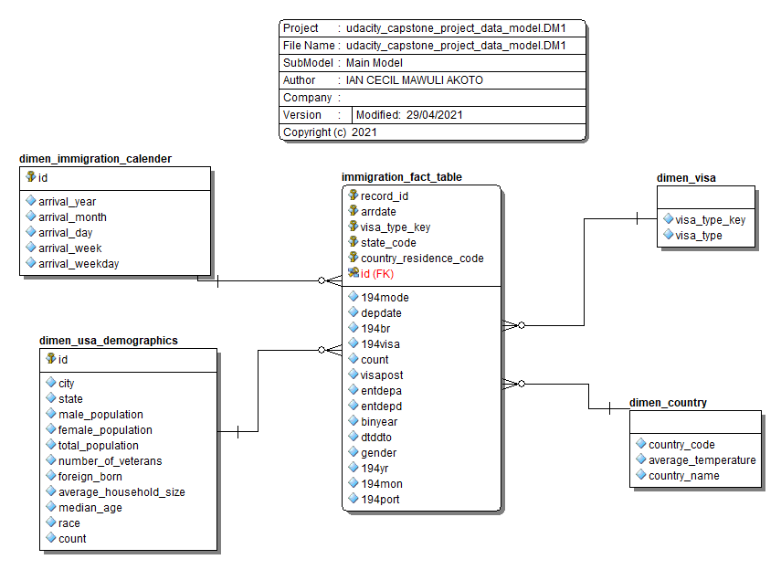

# Data Engineering Capstone Project

## Project Summary

The main objective of this project is to explore the datasets 194 immigration data, global land temperatures data, us demographics data and the airport-codes data, then create an ETL pipeline as a use case for an analytics database using Spark. A use case for this analytics database is to find immigration patterns to the US. For example, we could try to find answears to questions such as, do people from countries with warmer or cold climate immigrate to the US in large numbers?

The project follows the follow steps:

- Step 1: Scope the Project and Gather Data

- Step 2: Explore and Assess the Data

- Step 3: Define the Data Model

- Step 4: Run ETL to Model the Data

- Step 5: Complete Project Write Up

## Scope of Project

- Use spark to load the data into dataframe

- Perform Exploratory data analysis on 194 immigration dataset, missing values, e.t.c

- Perform Exploratory data analysis on global land temperatures dataset, missing values, e.t.c

- Perform Exploratory data analysis onairport-codes dataset, missing values, e.t.c

- Perform Exploratory data analysis on us-cities-demographics dataset, missing values, e.t.c

- Data cleaning on all datasets

- Creat fact table from the cleaned immigration dataset

- Create dimension tables

The technology used in this project is Amazon S3, Apache Spark. Data will be read and staged from the customers repository using Spark.

While the whole project has been implemented on this notebook, provisions has been made to run the ETL on a spark cluster through etl.py. The etl.py script reads data from S3 and creates fact and dimesion tables through Spark that are loaded back into S3.


## Data Model Definition




#### 4.3 Data dictionary 

**Fact-Table**

##### Immigration table

| Feature| Descriptions|
|--------|-------------|
|record_id| Unique record ID|
|country_residence_code| 3 digit code for immigrant country of residence|
|visa_type_key| A numerical key that links to the visa_type dimension table|
|state_code| US state of arrival|
|i94yr| 4 digit year|
|i94mon| Numeric month|
|i94port| Port of admission|
|arrdate| Arrival Date in the USA|
|i94mode|Mode of transportation (1 = Air; 2 = Sea; 3 = Land; 9 = Not reported)|
|i94addr|USA State of arrival|
|depdate| Departure Date from the USA|
|i94bir|Age of Respondent in Years|
|i94visa| Visa codes collapsed into three categories|
|count| Field used for summary statistics|
|dtadfile|Character Date Field - Date added to I-94 Files|
|visapost| Department of State where where Visa was issued|
|occup| Occupation that will be performed in U.S|
|entdepa| Arrival Flag - admitted or paroled into the U.S.|
|entdepd| Departure Flag - Departed, lost I-94 or is deceased|
|entdepu| Update Flag - Either apprehended, overstayed, adjusted to perm residence|
|matflag| Match flag - Match of arrival and departure records|
|biryear| 4 digit year of birth|
|dtaddto|Character Date Field - Date to which admitted to U.S. (allowed to stay until)|
|gender| Non-immigrant sex|


**Dimension Tables**

##### Country table

| Feature| Descriptions|
|--------|-------------|
|country_code|Unique country code|
|country_name| Name of country|
|average_temperature| Average temperature of country|


##### Visa Type table


| Feature| Descriptions|
|--------|-------------|
|visa_type_key| Unique record ID|
|visa_type| Name of Visa|


##### Calender table

| Feature| Descriptions|
|--------|-------------|
|id| Unique  ID|
|arrdate| Arrival date into US|
|arrival_year| Arrival year into US|
|arrival_month| Arrival MonthS|
|arrival_day| Arrival Day|
|arrival_week| Arrival Week|
|arrival_weekday| Arrival WeekDay|

##### US Demographics table


| Feature| Descriptions|
|--------|-------------|
|id| Unique  ID|
|state_code| US state code|
|City| City Name|
|State| US State where city is located|
|Median Age| Median age of the population|
|Male Population| Count of male population|
|Female Population|Count of female population|
|Total Population| Count of total population|
|Number of Veterans|Count of total Veterans|
|Foreign born|Count of residents of the city that were not born in the city|
|Average Household Size|Average city household size|
|Race|Respondent race|
|Count| Count of city's individual per race|


The us demographics dimension table comes from the demographics dataset and links to the immigration fact table at US state level. This dimension would allow analysts to get insights into migration patterns into the US based on demographics as well as overall population of states. 


The visa type dimension table comes from the immigration datasets and links to the immigaration via the visa_type_key.


The country dimension table is made up of data from the global land temperatures by city and the immigration datasets. The combination of these two datasets allows analysts to study correlations between global land temperatures and immigration patterns to the US.


## Running the Pipeline

### Prerequisite

- Python 3
- AWS EMR cluster
- Apache Spark
- configparser

### Running ETL pipeline
The ETL pipeline is defined in the etl.py script, and this script uses the util.py and helpers.py modules to create a pipeline that creates final tables in Amazon S3. to run in terminal:
```
$python etl.py
```

**Remember to shut down clusters if not in use.**


## Project Files

- Capstone Project Notebook.ipynb - Notebook of the project pipeline

- etl.py - Python Script to execute the etl pipeline

- helpers.py - etl helper functions

- util.py - python script containing utility functions for running the pipeline

- 194res.csv - country code and their names

- aws_config.cfg - AWS configuration for running spark clusters